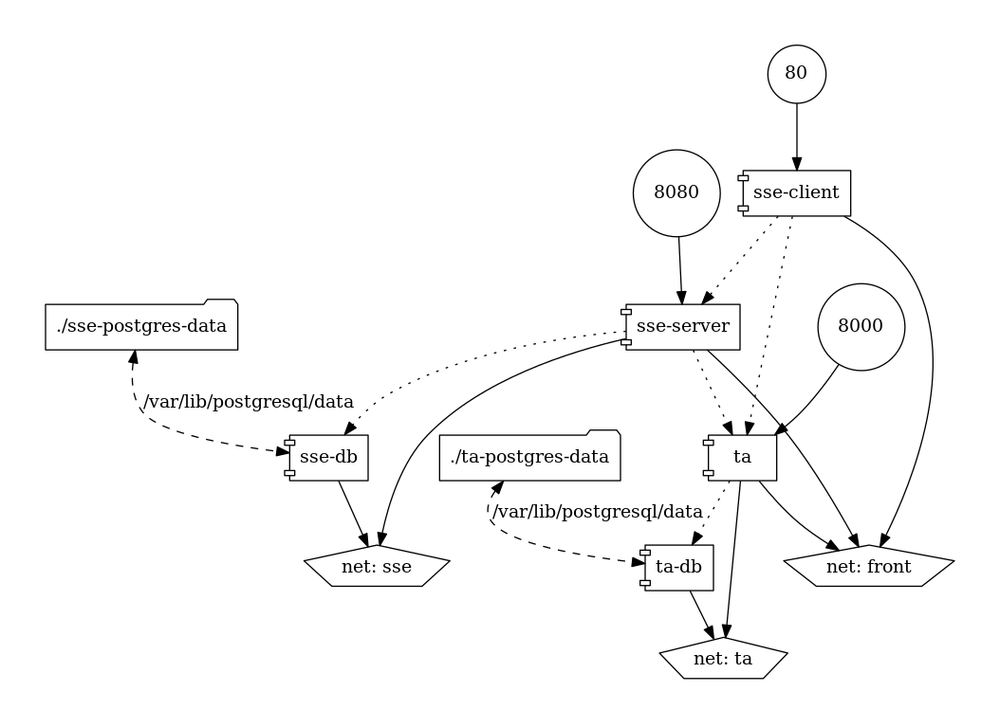

# asclepios-sse-docker-compose

docker-compose set up for the ASCLPIOS symmetric searchable encryption service

<p align="center">
  
</p>

## Usage

```
cp .env.example .env # edit this file to configure
docker-compose build
docker-compose up
```

Once it has successfully booted, each components is accessible on the host as follows:

* SSE Client - `http://localhost:80`
* SSE Server - `http://localhost:8080`
* TA - `http://localhost:8000`
